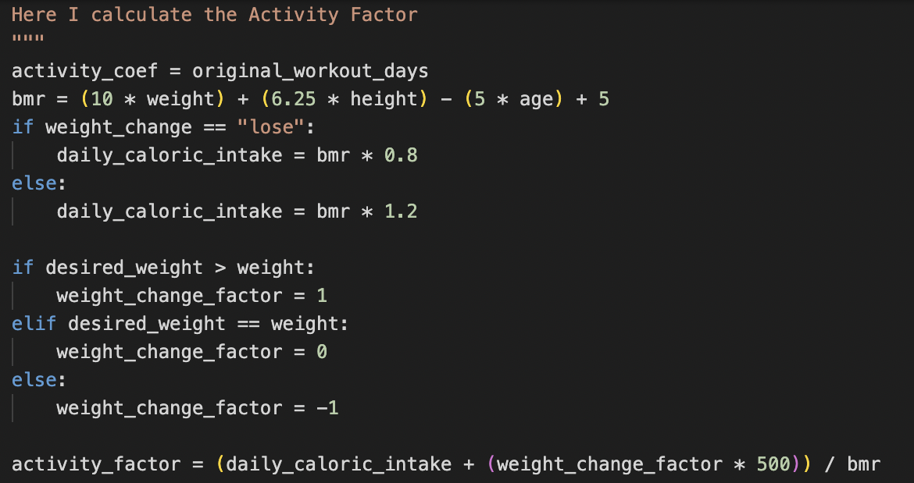
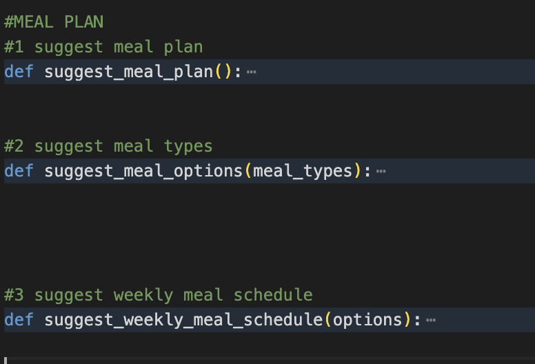
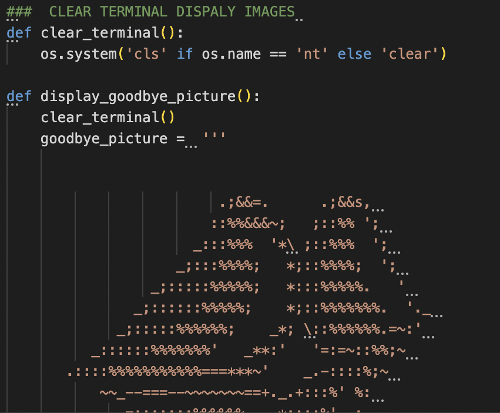
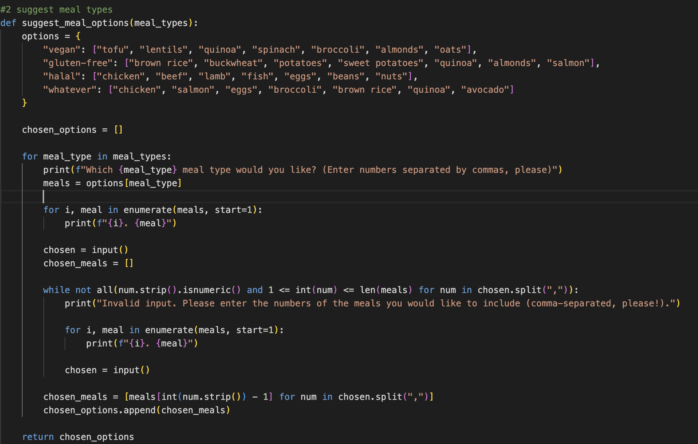
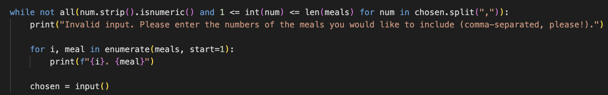
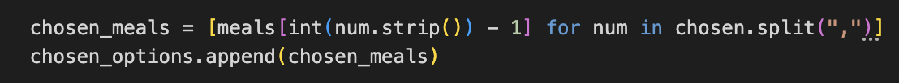

# 1000 SUNNY FITNESS ##

[Project 3](project_3)

## Table of contents 

- [1000 Sunny ](#project_3)
- [Table of contents](#table-of-contents)
- [Introduction / About](#introduction)
 - [Features](#features)
    -[Main Functions](#main-functions)
    - [User Info](#user-info)
    - [Weight Change](#weight-change) 
    - [Workout Functions](#workout-functions)
    - [Meal Functions](#meal-functions)
    - [ Error Handling / Validation ](#while-loops--validation)
  - [ASCII art](#ascii-art)
  - [Testing](#testing)
    - [Spread Sheet](#bugs-in-css)
    -[PEP8 Validation](#pep8-validation)
    - [Bugs](#bugs)
    -[Problems](#problems)
  - [Deployment](#deployment)
  - [Things I wanted to do but did not have the time](#things-i-wanted-to-do-but-did not have the time)
  - [Credits and Acknowledgements](#credits)
  - [Notes](#notes)

# Introduction #
# ABOUT  # 
* Welcome to the 1000 Sunny. What I have tried to create here is a basic and direct fitness web application. The name for this app "1000 Sunny" comes from my favorite manga One Piece, it is the name of the pirate ship they ride around in. The idea may be a little odd but I essentially am trying to create a Gym on the ship. It is not really essential to the functionality of the app but it gives me and the user a little context to opperate in. So the user is welcomed aboard the 1000 Sunny and then asked questions the correspond to their fitness goals and then the app  provides them with the proper information to help them get there. From what I have seen most fitness apps have too much going on and that repulses some people, the goal was to strip everything down to the basics and produce something minimalist but useful.

*NOTE*
* With respect to fitness and the science behind it ,almost all of the litterature is written in the lanaguage of male/female. I tried to to stay away from that completely. So I modified a lot of the typical equations to fit a more general and up to date point of view. I ask the user " what they identify as?" but that information is just fomality and has nothing to do with the calucations. Also as much as I can remember the user is refered to as They/Them. 

# Features # 
# Main Functions
## User Info
* This is essentially the main function, it is the essential intersection of everything. I Ask the user for some simple information then this infomation called later. 
* What is interesting about this function  are the bounds I place on the numerical inputs. I make sure the values are not too small or too big ( everything needs to be near human) so the BMR equation I use later makes sense.
* 

## Weight Change 
### Weight Loss/Gain
* This is the first function I wrote for this project , it essentially asks the user if they would like lose or gain weight then depending on their response responds accordingly and at the end gives them an estimated time it will take to achive this goal and how many calories per day they need to stay on mission. Nothing too fancy here , simple if/else condition.

## Workout Functions 

* These functions essentially work as a family , one depends on the other.  ( for clarity I label them 1-3, so the reader can follow)
### Suggest Workout Plan (function 1)
* The first function takes no parameters and creates a list "exercises",  I use a while loop to ask the user which exercises they would like to do all the while I am checking with another while loop if the input is valid ( this is a method I use throughout the entire project) 
* I then check if the user has chosen all the suggested exercises and if not I give them the oppotunity to add more, I essentially ask "would you like to add more?" and if the answer is no I break the loop if not the loop starts again. All the while the user input is checked for validation, on everything everywhere. If the input is not valid , the user gets one of the error messages. This is also a method I use nearly everywhere in the project.

### Suggest Workout Options (function 2)
* Unlike the first funtion in this family, here we take a paremter , "workout_types". I create the dictionary "options" to store the exercise options for each workout_type then I create an empty list called " chosen_options" to store the users chosen exercies for each workout type.  Here I iterate over the  workout types given in the "workout_types" parameter. This was the trickiest part to wrap my head around. The rest of the function I use for loops and empty lists "par for the course". The function returns a list containing the users chosen exercices from each workout type.
### Suggest Weekly Schedule (function 3)
* *NOTE* This function takes 2 parameters because I do a supplemetary calulcation depending on the users previous input.
*  First the function creates a list "days_of_the_week" and I ask the user to enter a number between 1-7 coressponding to how many days a week they would like to workout then I make sure the input is valid and convert it to an integer. What is a little tricky is this section here.  Here an empty dictionary is created so I can store a workout plan for each day of the week that the user has chosen. I use a loop to asisgn a workout plan to each day of the week (that is the workout_days variable that Im counting).  Then the "all_exercises" list is randomly shuffled and a random exercise is selected for that day then the random selection of exercises are stored in "workout_plan" and after all that the workout plan is matched to the corresponding day in the "weekly_schedule" dictionary. Finally the "workout_days" variable is decremented.
### Activity Factor (function 3.2)

* Here , if the user has chosen to have a workout plan I take that into account. 
Inside the suggest_weekly_schedule I extract weight ,height etc , from "user_info" so I can recalculate the BMR. I determine the "weight_change_factor" byt the relationship between weight and desired_weight. If the desired weight is lower the weight weight factor will be -1, if the factor is higher , thats weight gain, 0, weight maitenance. Then I do a rough calculation to determine how much MORE the user should eat on the days the workout( if any).

### Meal Functions
* The next "family" of functions offer the user a meal plan or a diet to help them on their fitness journey. 
* These functions do EXACTLY the same thing as the workout functions above so there is no need to explain them. The only diffence is in syntax, instead of workout types its food types , vegan, halal etc.
* With respect to variety,I tried to give a decent variety of options, vegan , halal , gluten free, then whatever ( which is a mix of everything , I want this app to feel human and this is how I talk and I am human, also I want to create things that I would use and would like to see, programs that are more fluid and direct instead of the feeling that you are being used and the person behind the program is actually a robot themselves.)  

## Clear Terminal / Image Display
* This is a pretty self explanatory function, I clear the terminal for each major "section" of the app then display and image. . Was defintely more tricky to make work with all the other functions than I expected.

# ASCII ART
* Theres nothing too special going on here. I have four ASCII images displayed in the terminal.! [Girl Image](assets/images/ascii_girl.png)
All the images I got from here [ASCII ART](https://www.asciiart.eu/) except the Jolly Roger Pirate flag. [Jolly Roger](assets/images/ascii_pirate_flag.png)In the early stages that was the first or second part I added to this project. It essentially shaped everything else in my minds eye. Also you can the way the prirate flag is written is totally different from the other 3 ASCII images. This is because the pirate flag I did at the beginning of the project and the other images towards the very end.

## WHILE LOOPS / Validation
* In many ways this project is just a huge exercise in validation and error handling. The vast majorty of my mental energy and time was spent checking user input was valid. I went from taking user input and making it lower case to for simple yes and no input to the very ends of what felt like was insanity and checked for spaces and commas. 
* The methods I use are the more or less the same throughout the project but Ill explain "the crown jewel" here. I went through this more times than I can count to end up at this version. Lets look at the "suggest_meal_options" function. I´ll walk through the entire function so everything makes sense in context. So first I loop over each meal_type in meal_types then I ask the user to choose an option from meal type then I go and get in from the options dictionary based on that selection. I then display the meal option with its corresponding number which the use will now choose from. This is where I have to use more precise langauge than I am used to and or comfortable with. I ask the user to "Enter numbers separated by commas" after Ive just given them a list with food names in the terminal, which may be a little counter-intuitive but it is the best I could do. So I am now taking the comma seperated user input and storing it in an empty list. Now for the validation ! The following while loop is what I use to do the validation. , The while loop checks if the input is numeric and fits in the range of meal options. If input is inlavid we get an error message as is expected. Here we need to unpack a little   The ".split" splits the user input by commas , then " int(num.strip())" converts each number into an intger after it removies any white spice by using strip(). This is the most important part, There were so many combinations or invalid input that crashed the whole program that this was more than necessary. Now the rest of the function works as exepected , I decrement meal from the meals list and I get a new list called "chosen_meals". chosen_meals gets appeneded to the chosen_options which stores the selected meal options and then returns it.

# Things I Wanted Do
- I spent a lot more time than I thought on displaying images in the terminal. Previously I had wanted to clear the terminal and display an image for each "section" but that quickly became a tangle of thorns. Too much extracting and rewritting. I ended up rewriting  and reaaraning so many times I lost track of what I was doing.
- I wanted to make the whole appl "modular" but I didnt have time to completely wrap my head around that, I  started trying to figure it out, I put different fucntions in different files but I didnt have the time to really grasp it and finish it.

# NOUBLIE PAS A FAIRE CA
# Bugs # 
* I dont even know where to start with the bugs. I had so many throoughout the whoel project,but I think they are all more or less resolved. The error handling was long. I had to learn and relearn a lot and Im still not totally sure. Looping and itietering overlist and and then checking things were input properly and looping again made space for so many bugs. Theres one thing I couldnt solve or didnt have the time to solve. I try my best to explain in plain english . NOUBLIE PAS A FAIRE CA 

an optio
# Problems
* I have hard time storing variables , Super hard time, taking info from other fucntions then using it or displaying it somehwere else. its tricky.

#
# NOTES # 
* The more I worked on this project the more I have learned to do things better and differntly as I progressed towards the end. It seems like theres a never-ending " better way" to do things in python. Once I solved a problem, left it and then came back to copy the function or whatever it was, to use it somewhere else I had found a better way to write the code. I could rewrite the code in this project over and over in endlessly different ways but that wouldnt get me anywhere so Ive settled for what Ive submitted here. Trying to make things work a "certain" way(thats to say how I saw them working in the narrow visoion of myminds eye) all the time was totally at my disadvatge. The problems, the way in which they arose and were eventually solved give my project flexibilty , which , from what Ive learned is more important than perfection.

