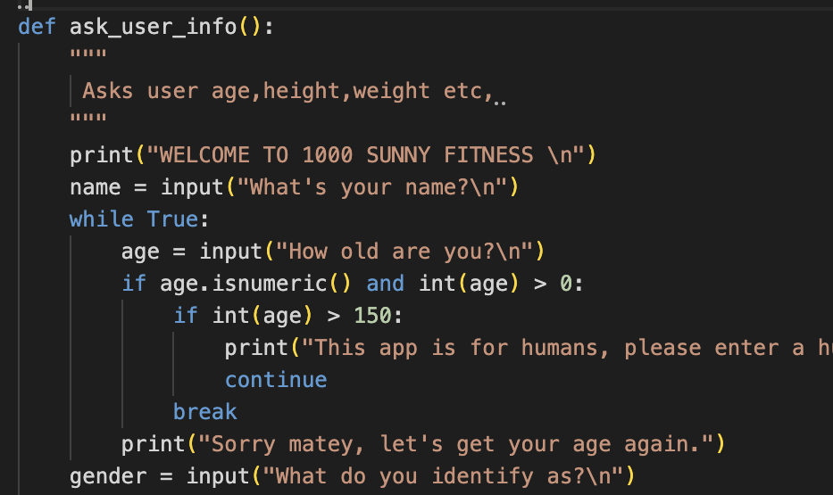
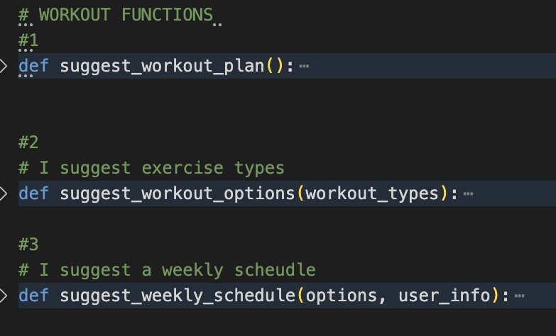
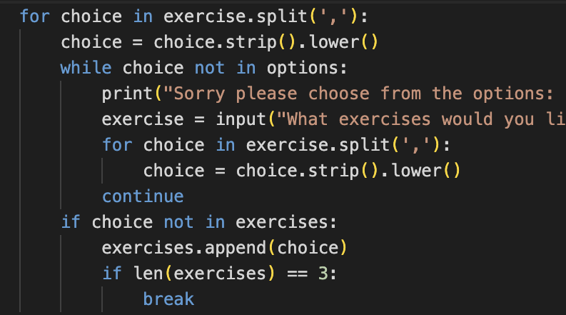
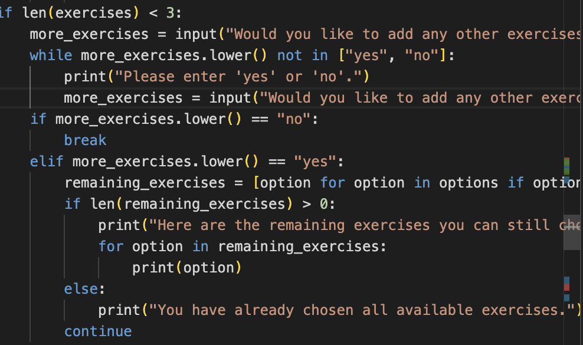
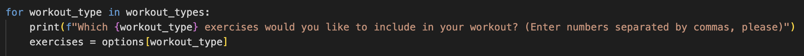
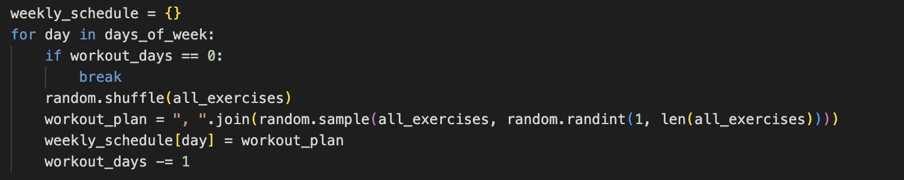

# 1000 SUNNY FITNESS ##

[Project 3](LINK TO PROJET 3)

## Table of contents 

- [1000 Sunny ](#project_3)
- [Table of contents](#table-of-contents)
- [Introduction / About](#introduction)
 - [Features](#features)
    -[Main Functions](#main-functions)
    - [User Info](#user-info)
    - [Weight Change](#weight-change) 
    - [Design](#design)
    - [Typography](#typography)
  - [Testing](#testing)
    - [HTML](#html)
    - [CSS](#css)
    - [Spread sheet](#spread-sheet)
    - [Java Script](#java-script)
    - [Individual Page Testing](#individual-page-testing)
  - [Bugs](#bugs)
    - [Bugs in CSS](#bugs-in-css)
    - [Bugs in Java Script](#bugs-in-java-script)
    - [Bugs in HTML](#bugs-in-html)
    - [Tutor suggestions](#tutuor-suggetions)
  - [Deployment](#deployment)
    - [Cloning and Forking](#cloning-and-forking)
    - [Local Deployment](#local-deployment)
    - [Remote Deployment](#remote-deployment)
  - [Media](#media)
  - [Credits and Acknowledgements](#credits)
  - [Additional Notes](#additional-notes)

# Introduction #
# ABOUT  # 
* Welcome to the 1000 Sunny. What I have tried to create here is a basic and direct fitness web application. The name for this app "1000 Sunny" comes from my favorite manga One Piece, it is the name of the pirate ship they ride around in. The idea may be a little odd but I essentially am trying to create a Gym on the ship. It is not really essential to the functionality of the app but it gives me and the user a little context to opperate in. So the user is welcomed aboard the 1000 Sunny and then asked questions the correspond to their fitness goals and then the app  provides them with the proper information to help them get there. From what I have seen most fitness apps have too much going on and that repulses some people, the goal was to strip everything down to the basics and produce something minimalist but useful.

# Features # 
# Main Functions
## User Info
* This is essentially the main function, it is the essential intersection of everything. I Ask the user for some simple information then this infomation called later. 
* What is interesting about this function  are the bounds I place on the numerical inputs. I make sure the values are not too small or too big ( everything needs to be near human) so the BMR equation I use later makes sense.
* 

## Weight Change 
### Weight Loss/Gain
* This is the first function I wrote for this project , it essentially asks the user if they would like lose or gain weight then depending on their response responds accordingly and at the end gives them an estimated time it will take to achive this goal and how many calories per day they need to stay on mission. Nothing too fancy here , simple if/else condition.

## Workout Functions 

* These functions essentially work as a family , one depends on the other.  ( for clarity I label them 1-3, so the reader can follow)
### Suggest Workout Plan (function 1)
* The first function takes no parameters and creates a list "exercises",  I use a while loop to ask the user which exercises they would like to do all the while I am checking with another while loop if the input is valid ( this is a method I use throughout the entire project) 
* I then check if the user has chosen all the suggested exercises and if not I give them the oppotunity to add more, I essentially ask "would you like to add more?" and if the answer is no I break the loop if not the loop starts again. All the while the user input is checked for validation, on everything everywhere. If the input is not valid , the user gets one of the error messages. This is also a method I use nearly everywhere in the project.

### Suggest Workout Options (function 2)
* Unlike the first funtion in this family, here we take a paremter , "workout_types". I create the dictionary "options" to store the exercise options for each workout_type then I create an empty list called " chosen_options" to store the users chosen exercies for each workout type.  Here I iterate over the  workout types given in the "workout_types" parameter. This was the trickiest part to wrap my head around. The rest of the function I use for loops and empty lists "par for the course". The function returns a list containing the users chosen exercices from each workout type.
### Suggest Weekly Schedule (function 3)
* *NOTE* This function takes 2 parameters because I do a supplemetary calulcation depending on the users previous input.
*  First the function creates a list "days_of_the_week" and I ask the user to enter a number between 1-7 coressponding to how many days a week they would like to workout then I make sure the input is valid and convert it to an integer. What is a little tricky is this section here.  Here an empty dictionary is created so I can store a workout plan for each day of the week that the user has chosen. I use a loop to asisgn a workout plan to each day of the week (that is the workout_days variable that Im counting).  Then the "all_exercises" list is randomly shuffled and a random exercise is selected for that day then the random selection of exercises are stored in "workout_plan" and after all that the workout plan is matched to the corresponding day in the "weekly_schedule" dictionary. Finally the "workout_days" variable is decremented.

## Activity Factor
* With this function I take into account  how many days if any the user has chosen to workout and do a little calculation and give the user the nuber of claories they should eat extra due to workout.

* Meals
* I do something very similar for the meal funtion. I give the user the option to choose a weekly meal plan according to their preferecnes.
* I tried to give a decent variety of options, vegan , halal , gluten free, then whatever ( which is a mix of everything , I want this app to feel human and this is how I talk and I am human, also I want to create things that I would use and would like to see, programs that are more fluid and direct instead of the feeling that you are being used and the creator just wants your money.)  
## Clear Terminal 
* kinda works

## WHILE LOOPS
* Theres a bunch of while loops , i should explain those.

# ERRROR CHECKING AND VALIDATION
* This project in its own way could be seen as an exercise in error handling and validation. Every question to the user is handled and validated ( essentially I make sure all the information I get from the user is legit. ) Doing this took up most of my time and mental ability.
## add image ??
* every step of the way , pretty my this whole project is an exrcise in error handling and validation

# Bugs # 
* There were alot of bugs ohlalala.

# Problems
* I have hard time storing variables , Super hard time, taking info from other fucntions then using it or displaying it somehwere else. its tricky.

# NOTES # 
* The more I worked on this project the more I have learned to do things better and differntly as I progressed towards the end. It seems like theres a never-ending " better way" to do things in python. Once I solved a problem, left it and then came back to copy the function or whatever it was, to use it somewhere else I had found a better way to write the code. I could rewrite the code in this project over and over in endlessly different ways but that wouldnt get me anywhere so Ive settled for what Ive submitted here. Trying to make things work a "certain" way(thats to say how I saw them working in the narrow visoion of myminds eye) all the time was totally at my disadvatge. The problems, the way in which they arose and were eventually solved give my project flexibilty , which , from what Ive learned is more important than perfection.

